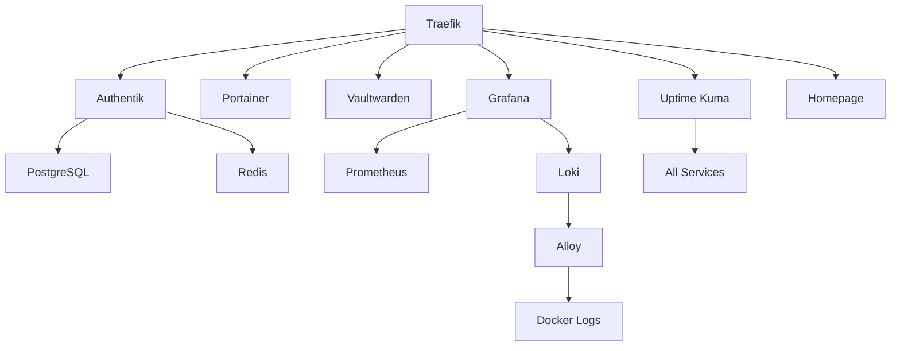

# Bootstreep Architecture

> Complete technical architecture reference for Bootstreep Homelab v1.0

## 🎯 Design Principles

| Principle | Implementation |
|-----------|----------------|
| **Idempotent** | Every script checks state before acting |
| **Modular** | 11 independent phases, runnable individually |
| **Declarative** | All infra in Git, no manual changes |
| **Secure by Default** | Zero-trust, defense-in-depth, least privilege |
| **Observable** | Logs, metrics, traces from day 1 |
| **Recoverable** | Automated backups + disaster recovery |
| **GitOps Ready** | Idempotent = can re-apply from Git any time |

---

## 🏗️ System Architecture

```
┌─────────────────────────────────────────────────────────────────────┐
│                       INTERNET / WAN                                │
└──────────────────────────────────┬──────────────────────────────────┘
                                   │
                    ┌──────────────┴──────────────┐
                    │     Cloudflare DNS          │
                    │  (DNSSEC, DDoS Protection)  │
                    └──────────────┬──────────────┘
                                   │ Ports 80, 443
                                   ▼
┌─────────────────────────────────────────────────────────────────────┐
│  Edge: Traefik v3.1                                                 │
│  - Let's Encrypt via Cloudflare DNS Challenge                       │
│  - Auto-renewal every 60 days                                       │
│  - Rate limiting (100 req/s per IP)                                 │
│  - Security headers (HSTS, X-Frame, CSP)                           │
│  - Request logging → Loki                                           │
└──────────────────────────────────┬──────────────────────────────────┘
                                   │
                    ┌──────────────┴──────────────┐
                    │   Docker Network: homelab   │
                    │   Subnet: 172.20.0.0/16     │
                    └──────────────┬──────────────┘
                                   │
        ┌──────────┬─────────┬─────┴─────┬──────────┬──────────┐
        ▼          ▼         ▼           ▼          ▼          ▼
   ┌────────┐ ┌────────┐ ┌────────┐ ┌─────────┐ ┌────────┐ ┌─────────┐
   │Authen- │ │Portai- │ │Vault-  │ │ Grafana │ │ Uptime │ │Homepage │
   │tik SSO │ │  ner   │ │warden  │ │         │ │  Kuma  │ │Dashboard│
   │+ Redis │ │        │ │(Passw.)│ │Dashb.   │ │Monitor │ │         │
   │+ PG    │ │        │ │        │ │         │ │        │ │         │
   └────────┘ └────────┘ └────────┘ └─────────┘ └────────┘ └─────────┘
        │
        ▼
   ┌──────────────────────────┐
   │  Observability Backend    │
   │  ┌──────────────────────┐ │
   │  │ Prometheus (metrics) │ │
   │  │ Loki (logs)          │ │
   │  │ Alloy (collector)    │ │
   │  └──────────────────────┘ │
   └──────────────────────────┘

┌─────────────────────────────────────────────────────────────────────┐
│                       HOST: Ubuntu 24.04 LTS                        │
│  ┌────────────────────────────────────────────────────────────────┐│
│  │ OS Layer: UFW, Fail2Ban, AppArmor, auditd, sysctl hardening    ││
│  ├────────────────────────────────────────────────────────────────┤│
│  │ Docker Engine CE (overlay2, live-restore, log rotation)       ││
│  ├────────────────────────────────────────────────────────────────┤│
│  │ Storage: /opt/docker/{compose,data,configs,backups,logs}      ││
│  ├────────────────────────────────────────────────────────────────┤│
│  │ Backup: Restic → S3/Hetzner/Backblaze (daily 03:00)           ││
│  └────────────────────────────────────────────────────────────────┘│
└─────────────────────────────────────────────────────────────────────┘
```

---

## 🌐 Network Topology

### Docker Network: `homelab`

- **Driver**: bridge
- **Subnet**: 172.20.0.0/16 (configurable via `docker.env`)
- **Inter-container DNS**: enabled (services resolve by name)
- **External access**: only via Traefik (no direct port exposure except for Traefik itself)

### Port Allocation

| Port | Service | Exposure |
|------|---------|----------|
| 80 | Traefik HTTP | Public (redirects to HTTPS) |
| 443 | Traefik HTTPS | Public |
| 9443 | Portainer | Optional, recommend via Traefik |
| 12345 | Alloy UI | Localhost only |

All other services are accessible only via `https://<service>.<domain>` through Traefik.

---

## 🔐 Security Architecture

### Defense in Depth (5 layers)

#### Layer 1: Network Edge
- Cloudflare proxy (DDoS protection)
- UFW firewall (allow 22, 80, 443 only)
- Fail2Ban (SSH + Traefik jails)

#### Layer 2: Host OS
- SSH key-only authentication
- Root login disabled
- PermitRootLogin no
- MaxAuthTries 3
- AppArmor enforced profiles
- Kernel sysctl hardening (rp_filter, SYN cookies, ASLR)

#### Layer 3: Container Runtime
- Docker with no-new-privileges
- Read-only docker.sock mounts
- Resource limits (CPU, memory)
- Healthchecks
- Log rotation (max 10m × 3 files)

#### Layer 4: Application
- Authentik SSO for unified authentication
- OIDC/OAuth2 for service integration
- No public signups
- Invitation-only user provisioning

#### Layer 5: Data
- Encrypted backups (Restic)
- Secrets in `.env` files (gitignored)
- No hardcoded credentials
- Database passwords ≥32 chars

---

## 📊 Observability Stack

### Metrics Flow

```
Services → cAdvisor → Prometheus → Grafana
                                ↓
                              Alerts (Alertmanager → Gotify/Telegram)
```

### Logs Flow

```
Docker/journald → Promtail/Alloy → Loki → Grafana
```

### Health Flow

```
Uptime Kuma → monitors all services
            → alerts on failure
            → public status page at status.<domain>
```

---

## 💾 Backup Architecture

### Backup Targets (3-2-1 rule)

| Tier | Target | Frequency | Retention |
|------|--------|-----------|-----------|
| Hot | Local `/opt/docker/backups` | Daily | 7 days |
| Warm | Hetzner Storage Box | Daily | 30 days |
| Cold | Backblaze B2 / S3 | Weekly | 90 days |

### What Gets Backed Up

1. **Docker volumes** (all data)
2. **Compose files** (infra definitions)
3. **Configuration files** (`/opt/docker/configs`)
4. **Database dumps** (PostgreSQL, Redis)
5. **Git repo state** (the repo itself)

### Recovery Scenarios

| Scenario | RTO | RPO |
|----------|-----|-----|
| Container crash | < 1 min | 0 |
| Volume corruption | < 10 min | 24 hours |
| Full host failure | < 1 hour | 24 hours |
| Complete data loss | < 4 hours | 24 hours |

---

## 🔄 Update Strategy

### Automatic (Watchtower)
- Daily at 04:00
- Rolling restart (one container at a time)
- Skips containers with `com.centurylinklabs.watchtower.enable=false`
- Cleanup of old images

### Manual (via Makefile)
```bash
make update   # Pull latest images
make deploy   # Recreate containers
```

---

## 📦 Service Dependencies



---

## 🚀 Scaling Path

### Single Node → Small Cluster
1. Add 2-3 worker nodes
2. Migrate to Docker Swarm or K3s
3. Move stateful services to dedicated storage node
4. Implement Traefik HA (multiple replicas)

### Small Cluster → Homelab Datacenter
1. Add dedicated monitoring node
2. Implement Rook-Ceph for distributed storage
3. Add dedicated backup target (NAS)
4. Implement Vault for secret management

---

## 📚 References

- [INSTALL.md](INSTALL.md) — Installation walkthrough
- [CONFIGURATION.md](CONFIGURATION.md) — Configuration reference
- [SERVICES.md](SERVICES.md) — Service catalogue
- [SECURITY.md](SECURITY.md) — Security model
- [TESTING.md](TESTING.md) — Testing guide
- [TROUBLESHOOTING.md](TROUBLESHOOTING.md) — Common issues